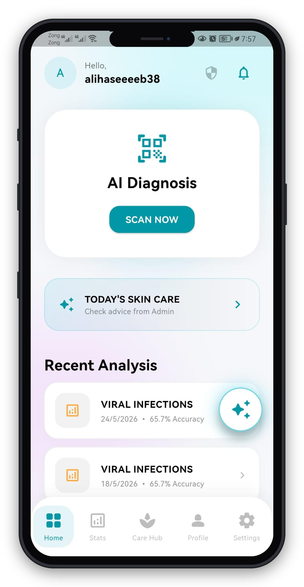
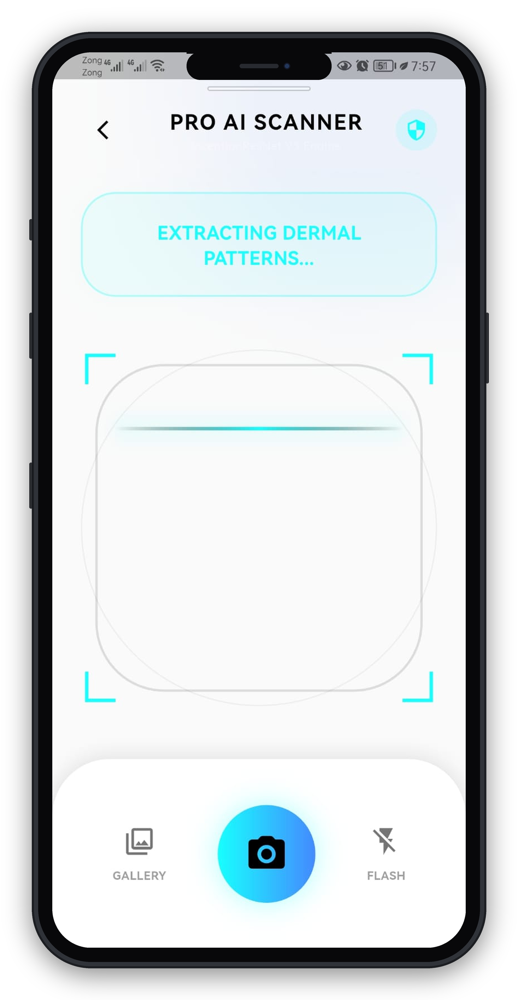
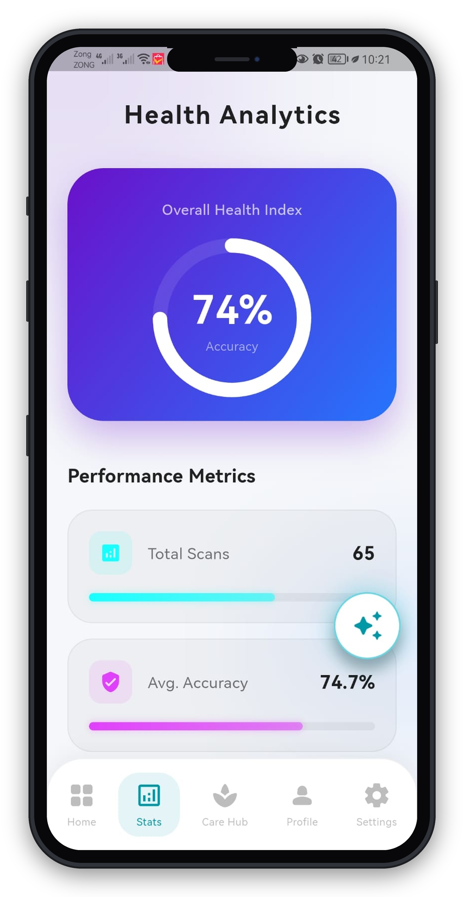
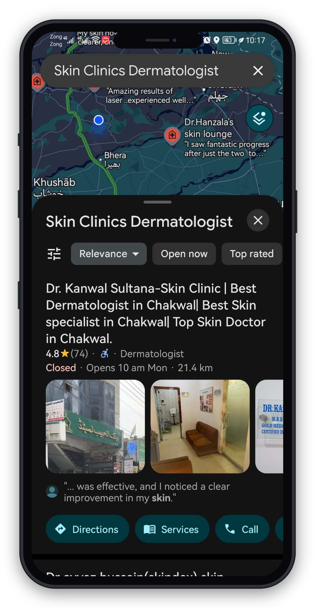

# SkinSentinel 🛡️📱

A Premium AI-powered Mobile Application designed for real-time and offline skin condition classification. By leveraging state-of-the-art Deep Learning models directly on-device, SkinSentinel ensures instantaneous analysis while preserving strict user data privacy.

---

## ✨ Experience the Vibe (Advanced Skin Analysis)
<p align="center">
  
</p>

---

## 🔍 Key App Modules & Features
<p align="center">
  
  
  
</p>

---

## 🚀 Why SkinSentinel?

* **🧠 On-Device Deep Learning:** 100% offline classification utilizing an optimized TensorFlow Lite (`.tflite`) model architecture.
* **⚡ Zero Frame Drops (60 FPS):** Powered by native **Dart Isolates (`compute()` framework)** to offload heavy image decoding and pixel normalization from the main UI thread, ensuring fluid performance.
* **🛡️ Privacy-First Framework:** Zero server-side interaction or image logging; all computational tasks are executed entirely within the client's secure hardware.
* **📍 Local Care Ecosystem:** Integrated local clinic geolocation mapping to connect users instantly with dermatological professionals when required.

---

## 🛠️ Technical Stack & Frameworks

* **Frontend Framework:** Flutter & Dart (Cross-Platform)
* **Core ML Engine:** TensorFlow Lite (TFLite)
* **Neural Network Backbone:** InceptionResNetV2 (High-accuracy powerhouse feature extractor)
* **Concurrency Model:** Dart Isolates / Background Worker Threads

---

## 📦 Project Architecture Overview

```text
lib/
├── screens/
│   ├── scanner_screen.dart     # Real-time UI thread & IsolateInterpreter logic
│   ├── result_screen.dart      # Inference output rendering & probability breakdown
│   └── dashboard.dart          # Centralized user analytics hub
├── modules/
│   └── hospital_map_screen.dart# Geolocation and mapping services
└── main.dart                   # Application bootstrap
